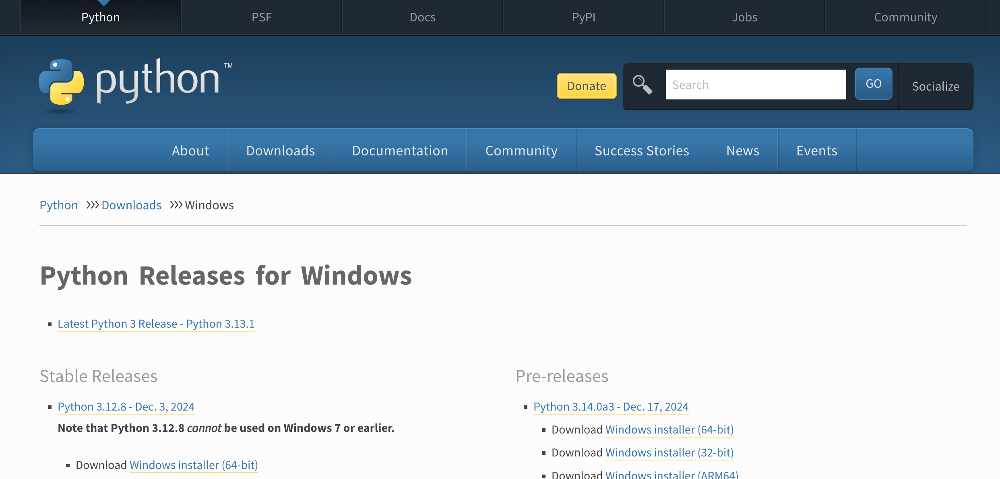
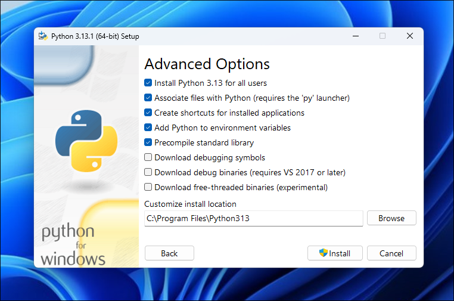
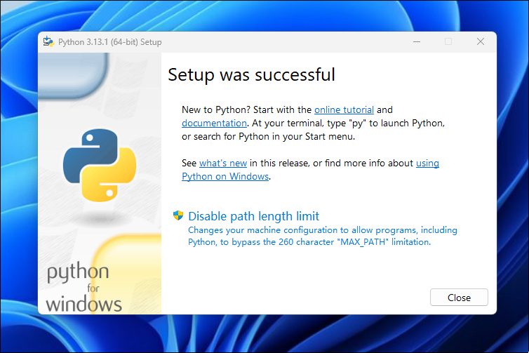

Python 是一种解释型编程语言。这种类型的编程语言，会将代码一句一句直接执行，不需要像编译语言（Compiled language）一样，经过编译器预先编译为机器代码，之后再执行。Python 程序运行的时候，需要利用 Python 解释器，动态地将代码逐句解释（interpret）为机器代码，然后再执行。

Python 官方推荐并维护的解释器是 CPython。CPython 目前支持 Windows, Linux, UNIX, macOS 等系统。下面让我们来安装它。

## Windows 系统

如图所示，使用浏览器打开 Python 网站中 [Windows 版本下载页面](https://www.python.org/downloads/windows/)。点击最上方的链接进入最新版本下载页面。

根据系统架构（32 位/64 位/ARM64）选择适当的安装包下载。

下载后，双击安装包开始安装。选中下方的 `Use admin privileges when installing py.exe` 与 `Add python.exe to PATH` 后，点击 `Customize installation` 开始安装。

第二页中的选项初学者大概不需要理会，直接点击 `Next` 进入下一页即可。

在第三页中，选中上方的 `Install Python 3.13 for all users` 以允许所有用户使用 Python。若有需要，更改下方的安装路径。点击 Install 以继续安装 Python。

当你看到下方的页面时，请点击一下中间的 `Disable path length limit`。恭喜你，你已成功将 Python 解释器安装至你的电脑。

## macOS 系统

TODO

## Linux 系统

Python 存在于大多数发行版的软件包仓库中。以下对几种常见的发行版中 Python 的安装方式进行详细描述。若未找到你的发行版，请前往发行版的软件包仓库中自行寻找，或参考自行编译。

### Debian/Ubuntu/Deepin/UOS 等 Debian 系发行版

使用 `sudo apt update; sudo apt install python-is-python3` 安装。

### Arch Linux

使用 `sudo pacman -Syy python` 安装。

### NixOS

使用 `nix-env -iA nixos.python313`、将 `nixos.python313` 写入 `/etc/nixos/configuration.nix` 中的 `enviroment.systemPackages` 部分或使用 Flake 安装。

### Fedora

使用 `sudo dnf upgrade --refresh; sudo dnf install python3` 安装。

## 自行编译

若在上方没有找到你的系统，可以尝试手动编译 CPython。

前往 [Python 源代码下载页](https://www.python.org/downloads/source/)，点击 `Latest Python3 Release` 并点击 Gzipped source tarball 下载最新版本的 Python 源代码。

使用 `tar xvzf [filename]` 解压压缩包。进入解压后的文件夹，使用 `./configure` 进行编译前的配置。配置过程会很快完成。完成后，使用 `sudo make install` 编译并安装。