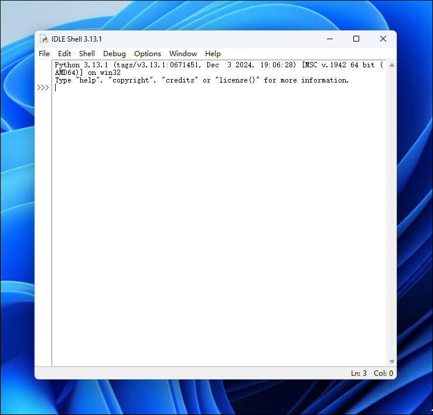
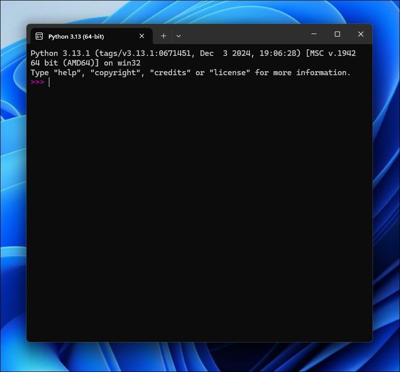

交互模式是 Python 中的重要模式。它允许用户逐行解析代码。

打开开始菜单中的 IDLE、Python 或在命令提示符中键入 `python`，你将看到如下内容：





交互模式启动时，会先输出 Python 的版本信息、系统信息等内容。当你看到提示符 `>>>` 时，Python 已经正在等待你的输入了。

输入 `exit()` 或按下 <kbd>Ctrl</kbd> + <kbd>D</kbd> 可退出交互模式。

了解了如何启动和退出 Python 的交互模式，我们就可以正式开始编写 Python 代码了。

在写代码之前，请千万不要用 “复制”-“粘贴” 把代码从页面粘贴到你自己的电脑上。写程序也讲究一个感觉，你需要一个字母一个字母地把代码自己敲进去，在敲代码的过程中，初学者经常会敲错代码：拼写不对，大小写不对，混用中英文标点，混用空格和 Tab 键，所以，你需要仔细地检查、对照，才能以最快的速度掌握如何写程序。

在提示符后直接键入代码，按回车，即可获得运行结果。试试输入 `114+514`，看看计算结果是不是 628：

```python
>>> 114+514
628
```

任何有效的数学计算都可以直接算出来。

如果要让 Python 打印出指定的文字，可以使用 `print` 函数。试试输入 `print("Hello, World!")`，看看会输出什么：

```python
>>> print("Hello, World!")
Hello, World!
```

暂时不需要理会为什么 `print` 后要加括号以及为什么 `Hello, World!` 要用双引号括起来。在下一节中我们将会继续了解。

输入 `exit()` 或按下 <kbd>Ctrl</kbd> + <kbd>D</kbd> 退出交互模式。恭喜你，你已经学会了如何编写简单的 Python 代码。但严格意义上来说，这并不能算作程序。它不具有自动执行的能力。